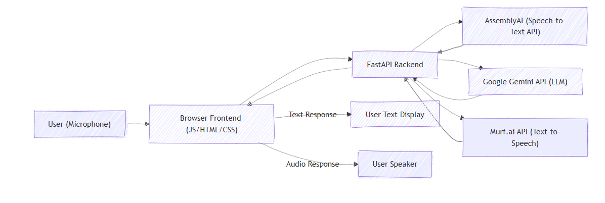

# Mini project


# Nutsy: The AI Hyperactive Squirrel 🐿️ — Voice Agent

A real-time voice chat interface that enables natural conversations with an AI assistant using speech recognition, language models, and text-to-speech synthesis.

---

## 🌟 Features

- **Voice Interaction:** Seamless speech-to-text and text-to-speech.
- **Context Memory:** Maintains conversation context for natural dialogue.
- **Real-time Processing:** Low latency with streaming audio.
- **Graceful Error Handling:** Fallbacks across the pipeline.
- **Modern UI:** Clean, responsive interface with visual feedback.
- **API Key Configuration:** Easily configure API keys via the UI.

---

## 🏗️ Architecture


### Flow

1. **Voice Capture**: The browser's built-in APIs handle the voice input from the user.
2. **Speech Recognition**: The audio data is sent to the AssemblyAI API, which transcribes the speech into text.
3. **Language Processing**: The transcribed text is then processed by the Google Gemini API to generate a relevant response.
4. **Voice Synthesis**: The text response from Gemini is converted into an audio stream by the Murf.ai API.
5. **Audio Output**: The synthesized audio is played back to the user through the browser.

---

## 🛠️ Tech Stack

### **Frontend**
- HTML5, CSS3, JavaScript  
- MediaRecorder API (capture), Web Audio API (playback)

### **Backend**
- Python 3.9+  
- FastAPI  
- AssemblyAI (STT), Google Gemini (LLM), Murf.ai (TTS)

---

## 🚀 Setup & Installation

### Prerequisites
- Python **3.9+**  
- API keys:  
  - AssemblyAI  
  - Google Gemini  
  - Murf.ai  
  - Tavily  
  - OpenWeatherMap  

---

### Environment Setup

1. **Clone the repository**:
    ```bash
    git clone <repository-url>
    cd voice-agent
    ```

2. **Create & activate a virtual environment**:

    **Windows (PowerShell)**:
    ```powershell
    python -m venv .venv
    .\.venv\Scripts\Activate.ps1
    ```

    **macOS/Linux**:
    ```bash
    python3 -m venv .venv
    source .venv/bin/activate
    ```

3. **Install dependencies**:
    ```bash
    pip install -r requirements.txt
    ```

4. **Configure environment variables**:
    Create a file named `.env` in the project root:
    ```properties
    ASSEMBLYAI_API_KEY=your_assemblyai_key
    GEMINI_API_KEY=your_gemini_key
    MURF_API_KEY=your_murf_key
    TAVILY_KEY=your_tavily_key
    WEATHER_API_KEY=your_weather_key
    ```
    **⚠️ Keep this file out of version control by adding `.env` to your `.gitignore` file.**

---

### Running the Application

1. **Start the FastAPI server**:
    ```bash
    uvicorn main:app --reload --host 0.0.0.0 --port 8000
    ```

2. **Open your browser and navigate to**:
    ```
    http://localhost:8000
    ```

---

## 📝 API Documentation

### Endpoints
- `GET /`: Serves the main application interface.
- `POST /agent/chat/{session_id}`: The voice chat endpoint for processing user input and generating responses.
- `GET /health`: A simple health check to verify that the API is running.
- `POST /api/set-keys`: Endpoint to update API keys via the UI.
- `GET /api/history/{session_id}`: Fetches chat history for a specific session.

---

### Error Handling
The application is built with comprehensive error handling to manage:
- Speech recognition failures.
- AI processing errors.
- Audio synthesis issues.
- Network connectivity problems.

---

## 🔒 Security Considerations

- API keys are securely stored in environment variables, not in the codebase.
- User sessions are managed on the server side to maintain security.
- Audio data is processed in-memory and not stored persistently.

---

## 📄 License
This project is licensed under the MIT License - see the LICENSE file for details.

---

## 🙏 Acknowledgments
- **AssemblyAI** for the powerful speech recognition API.
- **Google** for the Gemini Pro API.
- **Murf.ai** for the high-quality voice synthesis service.
- **OpenWeatherMap** for weather data integration.
- **FastAPI** for creating an amazing web framework.
